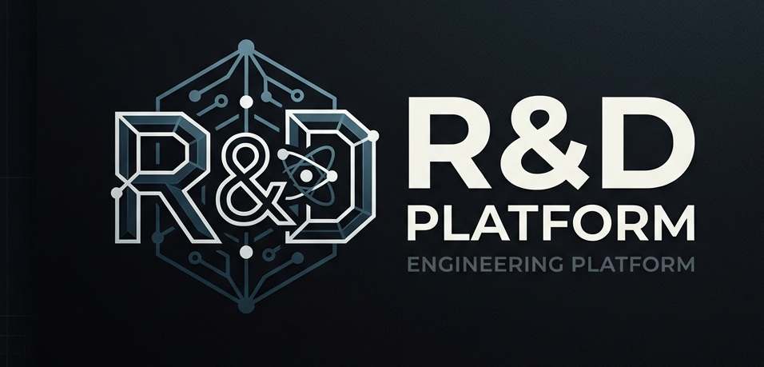

# R&D PLATFORM
### *High Fidelity Engineering Intelligence | Zero-Cloud Architecture*




---

## 🇮🇹 Manifesto Tecnico (Pozzuoli HQ)
La piattaforma R&D PLATFORM è un ecosistema di **Ingegneria Deterministica** progettato per eliminare il divario tra dati grezzi (CAD/BIM) e documentazione tecnica. In un mondo dominato da soluzioni cloud generiche, R&D PLATFORM opera in isolamento totale, garantendo che la proprietà intellettuale non lasci mai il perimetro aziendale.

### Core Capabilities:
1.  **Analisi BIM Deterministica**: Trasformazione automatica di modelli IFC in Distinte Base (BOM) tramite motori **Rust (Polars)** ad alte prestazioni. Il sistema não "adivinha" os quantitativos; esegue query SQL reali sui metadati estratti, garantendo precisione millimetrica.
2.  **RAG Tecnico ad Alta Granularità**: Superamento della natura probabilistica dell'IA generativa. Utilizziamo **SQLite-Vec** per ancorare ogni risposta a manuali tecnici reali. Questo non è solo un recupero dati, ma un protocollo di **Ingegneria della Verità**: ogni output è certificato con file, capitolo e pagina esatta, eliminando il rischio di allucinazioni in contesti mission-critical.
3.  **Documentazione Evolutiva**: Generazione di README, changelog e piani di test del firmware direttamente dalla codebase esistente, analizzando migliaia di righe di código C/Python in pochi secondi.

---

## 🧠 Orchestrazione & Agenti
La piattaforma opera tramite una rete di **Agenti Autonomi** orchestrati da **LangGraph**. A differenza dei chatbot lineari, il nostro sistema utilizza un **Rilevamento Semantico dell'Intento**:

- **BOM Agent**: Equipaggiato con il parser IFC, estrae la gerarchia spaziale e i materiali.
- **Code Agent**: Mappa dipendenze e logica di firmware critici.
- **RAG Agent**: Gestisce l'indicizzazione e il recupero vettoriale su larga scala con citazioni precise.

---

## 🏗️ Architettura & Scalabilità Industriale
Sviluppata seguendo i principi di **Termodinamica del Software**, la piattaforma minimizza l'entropia del codice garantendo prestazioni industriali:
- **FastAPI & LangGraph**: Per un'orchestrazione di stati asincrona e robusta.
- **Big Data CAD (Polars)**: Utilizzo del motore **Rust (Polars)** per il processamento ultra-veloce di file IFC. Abbiamo preferito Polars a Pandas per la sua architettura **multithreaded** e il motore **lazy execution**, garantendo scalabilità industriale senza il debito tecnico dei tool legacy.
- **Massive Document Library**: Gestione di migliaia di manuali tramite **SQLite-Vec**. Abbiamo rigettato database pesanti come ChromaDB o FAISS per favorire la **portabilità ACID** e la **complessità zero**: un unico file per metadati e vettori, ottimizzato per l'esecuzione locale in air-gap.

---

## 👨‍💻 Thiago C. Mendonça
*Senior Software Architect & System Designer*

Questa piattaforma non è solo uno strumento; è una prova di **Ingegneria di Precisione**. Dalla gestione rigorosa della memoria alla pulizia delle sessioni (Protocollo Tabula Rasa), ogni riga di codice è stata scritta per resistere alle condizioni critiche del settore R&D industriale.

---
**Links Professionali:**
- [**LinkedIn**](https://www.linkedin.com/in/thiagomendonca/)
- [**Curriculum Vitae (Digital)**](https://floodnet666.github.io/CV.2026/cv.final.html)

---

## 🛠️ Inizializzazione Rapida
Per istruzioni dettagliate sul setup e sulla configurazione dei modelli AI, consultare il file [INSTALL.md](./INSTALL.md).

```bash
docker-compose up --build -d
```

*R&D PLATFORM - Built for Excellence.*
